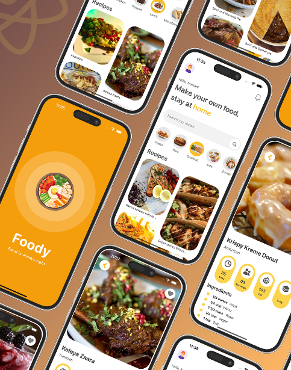

# Food-Recipe-App-React-Native

## Get Started

install dev dependencies

#### `npm install` or `yarn install`

## Then

Run The app

#### `npm start` or `yarn start`

Runs your app in development mode.

Open it in the [Expo app](https://expo.io) on your phone to view it. It will reload if you save edits to your files, and you will see build errors and logs in the terminal.

#### `npm run ios` or `yarn run ios`
